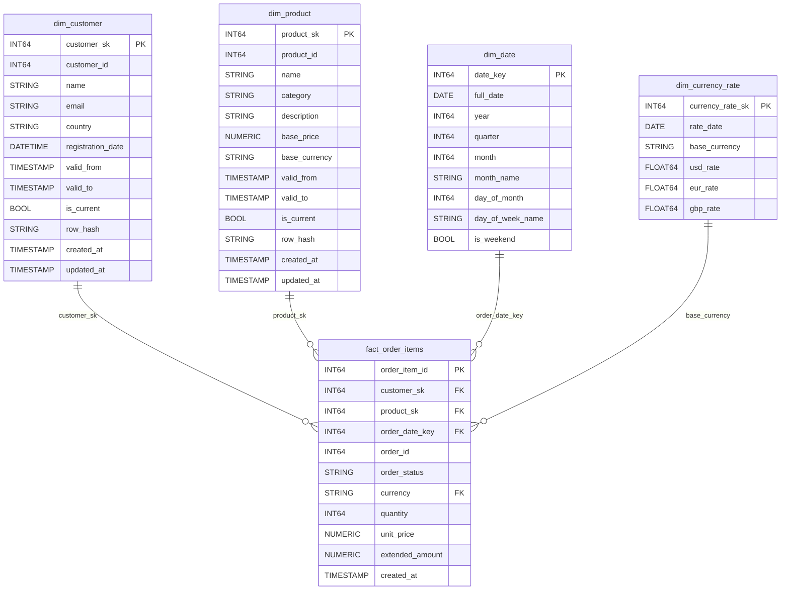
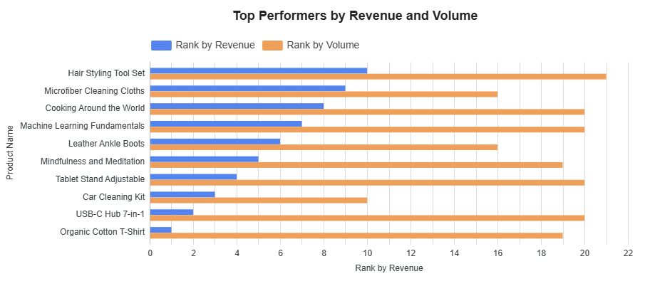
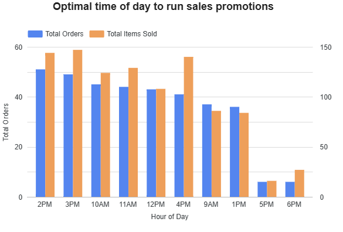

# Technical Architecture & Pipeline Documentation


## Architecture Diagram


## 1. Data Sources & Ingestion Tier

### PostgreSQL Data Ingestion (CDC)
* **Tooling:** GCP Datastream
* **Target:** BigQuery (`bronze` dataset)
* **Scope:** Replicates core tables (`customers`, `orders`, `order_items`, and `product_descriptions`) in their native schema.
* **Architecture & Value:** Datastream provides a fully managed, serverless Change Data Capture (CDC) mechanism. It streams transactional changes from PostgreSQL to BigQuery in near real-time, automatically scales with data volume, and operates on a consumption-based pricing model.

### External API Ingestion
* **Tooling:** GCP Cloud Run (Python container), managed via Cloud Composer (Apache Airflow)
* **Target:** BigQuery (`bronze` dataset)
* **Scope:** Fetches exchange rate data in JSON format from an external provider and performs a dynamic upsert/merge into the raw staging layer.
* **Design Decision:** Running the extraction script on Cloud Run offloads heavy network and compute operations from Cloud Composer, preventing worker resource depletion and cluster performance degradation. Cloud Run’s serverless nature ensures zero cost when idle.

---

## 2. Data Warehouse Architecture & Transformation

### Medallion Architecture Strategy
The Data Warehouse is structured using a Medallion Architecture within BigQuery to maintain high data lineage and quality standards:

| Layer | Dataset | Description |
| :--- | :--- | :--- |
| **Bronze** | `bronze` | **Raw Ingestion Layer:** Stores unmodified raw data directly from PostgreSQL and the currency API. |
| **Silver** | `silver` | **Enterprise Data Layer:** Serves as the single source of truth. Holds cleansed, normalized, and validated data. |
| **Gold** | `gold` | **Analytics Layer:** Hosts business-level dimensional models (Star/Snowflake Schema) optimized for reporting. |

### Transformation & Quality Control
* **Tooling:** dbt (data build tool)
* **Implementation:** Performs all downstream ETL/ELT transformations from `bronze` through to `gold`. 
* **Data Governance:** Executes automated dbt tests (uniqueness, referential integrity, non-null constraints) to enforce data quality standards across all transformation models.

---

## 3. Workflow Orchestration

**Cloud Composer (Apache Airflow)** serves as the central orchestrator, executing scheduled workflows aligned with business freshness SLAs.

* `dag-currency-conversion-api`: Triggers the Cloud Run container to pull exchange rates and update the `bronze` dataset.
* `dag-sales-dashboard`: Orchestrates the sequential execution of dbt models to transform raw data through `silver` and `gold` layers.

---

## 4. Business Intelligence & Analytics

* **Tooling:** Looker
* **Implementation:** Connects directly to modeled data structures in the `gold` dataset to deliver self-service analytics and executive dashboards.

---

## 5. CI/CD & Version Control

* **Repository:** GitHub serves as the single repository for BigQuery schemas, Cloud Run container definitions, and dbt transformation code.
* **Deployment Pipeline:**
  1. **Peer Review:** Code changes require formal Pull Request (PR) approval from team members.
  2. **Automated Deployment:** Merges into the main branch trigger GitHub Actions workflows to validate code and deploy updates directly to the production environment.

## Dimensional Model Overview

### Fact Table
* **`fact_order_items`**
  * **Grain:** One record per individual order line item.
  * **Business Utility:** Enables granular analysis of item-level performance, basket composition, and sales metrics across various dimensions.

### Dimension Tables
To maintain a historical record of changes over time, all core dimensions utilize **Slowly Changing Dimension (SCD) Type 2** tracking. Synthetic **Surrogate Keys** serve as the primary keys to manage versioning independently of operational source keys.

* **`dim_customer`** – Captures point-in-time customer profile and attribute history.
* **`dim_products`** – Tracks product attribute updates and pricing revisions over time.
* **`dim_date`** – Standard calendar dimension supporting date-based rollups and temporal aggregations.

### DDL Scripts
* [create_dimensional_tables_ddl.sql](layers/gold/create_dimensional_tables_ddl.sql) – DDL definitions for instantiating the Gold layer dimensional schema.


### Dimensional Diagram:



## ETL Transformation SQLs

- [dim_customer.sql](layers/gold/dim_customer.sql)
- [dim_products.sql](layers/gold/dim_product.sql)
- [dim_date.sql](layers/gold/dim_date.sql)
- [fact_order_items.sql](layers/gold/fact_order_items.sql)


## Business questions

1. Which products are the top performers in terms of sales volume and revenue?

BI Mockup:




SQL used to retrieve top performers by volume and revenue:
```
WITH product_sales AS (
    SELECT
        p.product_id,
        p.name AS product_name,
        p.category,
        SUM(f.quantity) AS total_units_sold,
        SUM(f.extended_amount) AS total_revenue,
        COUNT(DISTINCT f.order_id) AS total_orders
    FROM `gold.fact_order_items` f
    JOIN `gold.dim_product` p 
        ON f.product_sk = p.product_sk
    -- Exclude non-completed sales if applicable
    WHERE f.order_status = 'completed'
    GROUP BY 1, 2, 3
)
SELECT
    product_id,
    product_name,
    category,
    total_units_sold,
    total_revenue,
    total_orders,
    -- Ranking by revenue
    DENSE_RANK() OVER (ORDER BY total_revenue DESC) AS rank_by_revenue,
    -- Ranking by sales volume (units)
    DENSE_RANK() OVER (ORDER BY total_units_sold DESC) AS rank_by_volume
FROM product_sales
ORDER BY rank_by_revenue ASC
LIMIT 10;
```

2. What is the optimal time of day to run sales promotions, based on historical transaction patterns?

BI Mockup:




SQL used to retrieve the optimal time of day to run sales promotions:

```
SELECT
    d.is_weekend,
    EXTRACT(HOUR FROM o.order_date) AS hour_of_day,
    COUNT(DISTINCT f.order_id) AS total_orders,
    SUM(f.quantity) AS total_items_sold,
    ROUND(SUM(f.extended_amount), 2) AS total_revenue,
    ROUND(AVG(f.extended_amount), 2) AS avg_line_item_value
FROM `gold.fact_order_items` f
JOIN `gold.dim_date` d 
    ON f.order_date_key = d.date_key
-- Join bronze/staging orders to access the hour from timestamp
JOIN `bronze.orders` o 
    ON f.order_id = o.id
WHERE f.order_status = 'completed'
GROUP BY 1, 2
ORDER BY 
    d.is_weekend DESC, 
    total_orders DESC;
```


