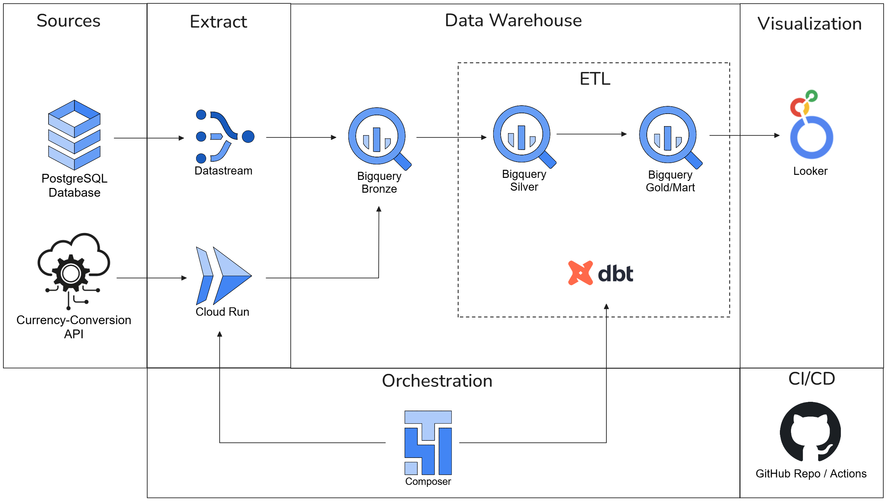

# Data Warehouse & Pipeline Design for eCommerce Analytics

## Architecture Overview



### Sources and Extract/Ingest:

- PostgreSQL Database and DataStream: 
    - Datastream is the GCP tool used to extract data from the PostgreSQL database and ingest data into Bigquery tables in a Bronze tier (Bigquery dataset) keeping the original data structure.
    
    - DataStream can be configured to replicate data only from required tables: customers, orders, order_items and product_descriptions.

    - Benefits of using DataStream is that it is a serverless solution and it streams all the changes from the source database in almost real time using CDC approach. It can automatically scale up and down according to the data load needs and the cost is calculated based on the amount of data processing.

- API and Cloud Run: 
    - To extract updated currency conversion data from an external API, Cloud Run can be used to execute a Python code to access the external API to receive json data, and merge the data into the Bigquery table in the Bronze tier.
    - To orchestrate the update of currency convertion data we are using an Airflow/Composer DAG to trigger the Cloud Run.
    - Benefits of using Cloud Run is that it is a Serverless solution and can automatically scale up and down according to the Computing needs and the cost is calculated can be zero when it is not being used.
    - We could use the Python code inside the DAG instead of using a Cloud Run, but it is not a very good practice to use Airflow/Composer cluster as compute for data ingestion processes as in can cause performance degration to Airflow/Composer cluster.


### Data Warehouse and ETL
- Medallion Architecture is being used for this Data Warehouse solution:
    - Bronze Layer: Bigquery dataset "bronze" is created to store the raw data extracted from database and external API keeping it's original data sctructure.
    - Silver Layer: BigQuery "silver" dataset serves as the source of truth, storing bronze-tier data transformed through cleansing and standardization.
    - Gold Layer: Bigquery dataset "gold" is created to store transformed data into a dimentional modeling structure from silver tier to be accessed from Looker dashboard.
- DBT is being used to perform all the ETL data pipeline transformations and Data Quality validations (dbt tests).

### Orchestration
Airflow/Composer is the tool used to orchestrate the data pipelines. DAGs can be scheduled to run on an interval accordingly to the business needs to have updated data.

For this solution we have 2 DAGs:
- dag-currency-conversion-api: to trigger the Cloud Run to extract/ingest data from external API into Bigquery.
- dag-sales-dashboard: to trigger DBT models to perform ETL data transformations in BigQuery.
    
### Visualization
Looker is the tool used to answer business questions using dashboards.

### CI/CD
Github is used as the code repository for the Bigquery tables, Cloud Run code/docker container and DBT code/tests. We can configure Github to have a Code Review by another developer team member and during the merge process it can trigger GitHub Actions to move the changes to production.


## Dimensional Modeling

Dimensional modeling & schema design — star schema, grain, keys/constraints, data types, support for both business questions.

For the grain of the fact table we are using order items so we can answer questions related to order items details. 
For the dimension tables we are using SCD Type 2 so we can have access to a point in time history of the versions of earch record.


## ETL Examples


## Business questions

1. Which products are the top performers in terms of sales volume and revenue?
```
WITH product_sales AS (
    SELECT
        p.product_id,
        p.name AS product_name,
        p.category,
        SUM(f.quantity) AS total_units_sold,
        SUM(f.extended_amount) AS total_revenue,
        COUNT(DISTINCT f.order_id) AS total_orders
    FROM `gold.fact_order_items` f
    JOIN `gold.dim_product` p 
        ON f.product_sk = p.product_sk
    -- Exclude non-completed sales if applicable
    WHERE f.order_status NOT IN ('CANCELLED', 'REFUNDED')
    GROUP BY 1, 2, 3
)

SELECT
    product_id,
    product_name,
    category,
    total_units_sold,
    total_revenue,
    total_orders,
    -- Ranking by revenue
    DENSE_RANK() OVER (ORDER BY total_revenue DESC) AS rank_by_revenue,
    -- Ranking by sales volume (units)
    DENSE_RANK() OVER (ORDER BY total_units_sold DESC) AS rank_by_volume
FROM product_sales
ORDER BY rank_by_revenue ASC
LIMIT 10;
```

2. What is the optimal time of day to run sales promotions, based on historical transaction patterns?

```
SELECT
    d.is_weekend,
    EXTRACT(HOUR FROM o.order_date) AS hour_of_day,
    COUNT(DISTINCT f.order_id) AS total_orders,
    SUM(f.quantity) AS total_items_sold,
    ROUND(SUM(f.extended_amount), 2) AS total_revenue,
    ROUND(AVG(f.extended_amount), 2) AS avg_line_item_value
FROM `gold.fact_order_items` f
JOIN `gold.dim_date` d 
    ON f.order_date_key = d.date_key
-- Join bronze/staging orders to access the hour from timestamp
JOIN `bronze.orders` o 
    ON f.order_id = o.id
WHERE f.order_status = 'completed'
GROUP BY 1, 2
ORDER BY 
    d.is_weekend DESC, 
    total_orders DESC;
```


INSERT INTO `bronze.base_currency` (base, date, rates)
VALUES
  ('USD', DATE '2024-06-01', STRUCT(1.0 AS USD, 0.9285 AS EUR, 0.7911 AS GBP)),
  ('EUR', DATE '2024-06-01', STRUCT(1.0770 AS USD, 1.0 AS EUR, 0.8520 AS GBP)),
  ('GBP', DATE '2024-06-01', STRUCT(1.2641 AS USD, 1.1737 AS EUR, 1.0 AS GBP)),
  ('USD', DATE '2024-09-15', STRUCT(1.0 AS USD, 0.9042 AS EUR, 0.7628 AS GBP)),
  ('EUR', DATE '2024-09-15', STRUCT(1.1059 AS USD, 1.0 AS EUR, 0.8436 AS GBP));


INSERT INTO `bronze.product_descriptions` (id, name, category, description, base_price, currency) VALUES
(1, 'Wireless Bluetooth Headphones', 'Electronics', 'Premium noise-cancelling wireless headphones with 30-hour battery life', 89.99, 'USD'),
(2, 'Smart Fitness Watch', 'Electronics', 'Advanced fitness tracker with heart rate monitoring and GPS', 299.99, 'USD'),
(3, 'Portable Bluetooth Speaker', 'Electronics', 'Waterproof portable speaker with 360-degree sound', 356.25, 'USD'),
(4, '4K Webcam', 'Electronics', 'Ultra HD webcam with auto-focus and noise reduction', 367.25, 'USD'),
(5, 'Wireless Charging Pad', 'Electronics', 'Fast wireless charger compatible with all Qi-enabled devices', 423.75, 'USD'),
(6, 'Gaming Mechanical Keyboard', 'Electronics', 'RGB backlit mechanical keyboard with blue switches', 345.60, 'USD'),
(7, 'Ergonomic Wireless Mouse', 'Electronics', 'Precision wireless mouse with ergonomic design', 189.99, 'USD'),
(8, 'Tablet Stand Adjustable', 'Electronics', 'Universal adjustable stand for tablets and phones', 299.99, 'USD'),
(9, 'USB-C Hub 7-in-1', 'Electronics', 'Multi-port hub with HDMI, USB 3.0, and SD card slots', 456.80, 'USD'),
(10, 'Smartphone Camera Lens Kit', 'Electronics', '3-in-1 lens kit with wide-angle, macro, and fisheye lenses', 423.55, 'USD'),

(11, 'Organic Cotton T-Shirt', 'Clothing', 'Soft organic cotton t-shirt available in multiple colors', 289.45, 'USD'),
(12, 'Denim Jacket Classic', 'Clothing', 'Timeless denim jacket with vintage wash finish', 72.91, 'USD'),
(13, 'Running Shorts Athletic', 'Clothing', 'Lightweight athletic shorts with moisture-wicking fabric', 298.75, 'USD'),
(14, 'Wool Blend Sweater', 'Clothing', 'Cozy wool blend sweater perfect for cold weather', 89.25, 'USD'),
(15, 'Leather Ankle Boots', 'Clothing', 'Genuine leather ankle boots with comfortable sole', 78.25, 'USD'),
(16, 'Cotton Hoodie Pullover', 'Clothing', 'Comfortable cotton hoodie with kangaroo pocket', 278.90, 'USD'),
(17, 'Silk Scarf Luxury', 'Clothing', 'Premium silk scarf with elegant pattern design', 367.25, 'USD'),
(18, 'Athletic Leggings', 'Clothing', 'High-waisted leggings with compression fit', 267.40, 'USD'),
(19, 'Casual Button-Down Shirt', 'Clothing', 'Versatile button-down shirt suitable for work or casual wear', 199.99, 'USD'),
(20, 'Winter Puffer Jacket', 'Clothing', 'Insulated puffer jacket with water-resistant coating', 298.70, 'USD'),

(21, 'The Art of Data Science', 'Books', 'Comprehensive guide to modern data science techniques and applications', 298.45, 'USD'),
(22, 'Mindfulness and Meditation', 'Books', 'Practical guide to incorporating mindfulness into daily life', 77.31, 'USD'),
(23, 'Cooking Around the World', 'Books', 'International cookbook with recipes from 50 countries', 234.75, 'USD'),
(24, 'Digital Photography Mastery', 'Books', 'Complete guide to digital photography for beginners and professionals', 234.85, 'USD'),
(25, 'Sustainable Living Guide', 'Books', 'Practical tips for eco-friendly living and reducing environmental impact', 234.50, 'USD'),
(26, 'Financial Planning Basics', 'Books', 'Essential guide to personal finance and investment strategies', 189.95, 'USD'),
(27, 'Creative Writing Workshop', 'Books', 'Exercises and techniques for improving creative writing skills', 89.45, 'USD'),
(28, 'Home Gardening Encyclopedia', 'Books', 'Complete guide to growing vegetables, herbs, and flowers at home', 98.76, 'USD'),
(29, 'Machine Learning Fundamentals', 'Books', 'Introduction to machine learning concepts and algorithms', 245.90, 'USD'),
(30, 'Travel Photography Tips', 'Books', 'Professional techniques for capturing stunning travel photos', 278.95, 'USD'),

(31, 'Ceramic Plant Pot Set', 'Home & Garden', 'Set of 3 decorative ceramic pots with drainage holes', 278.60, 'USD'),
(32, 'LED String Lights', 'Home & Garden', 'Warm white LED string lights perfect for indoor and outdoor use', 298.55, 'USD'),
(33, 'Bamboo Cutting Board', 'Home & Garden', 'Eco-friendly bamboo cutting board with juice groove', 156.80, 'USD'),
(34, 'Essential Oil Diffuser', 'Home & Garden', 'Ultrasonic aromatherapy diffuser with color-changing LED', 123.45, 'USD'),
(35, 'Memory Foam Pillow', 'Home & Garden', 'Contoured memory foam pillow for better sleep support', 234.90, 'USD'),
(36, 'Stainless Steel Water Bottle', 'Home & Garden', 'Insulated water bottle that keeps drinks cold for 24 hours', 48.57, 'USD'),
(37, 'Microfiber Cleaning Cloths', 'Home & Garden', 'Pack of 12 ultra-soft microfiber cleaning cloths', 72.95, 'USD'),
(38, 'Solar Garden Lights', 'Home & Garden', 'Set of 8 solar-powered LED garden pathway lights', 34.99, 'USD'),
(39, 'Non-Stick Cookware Set', 'Home & Garden', '10-piece non-stick cookware set with heat-resistant handles', 78.45, 'USD'),
(40, 'Throw Blanket Cozy', 'Home & Garden', 'Ultra-soft fleece throw blanket perfect for couch or bed', 34.99, 'USD'),

(41, 'Yoga Mat Premium', 'Sports & Outdoors', 'Non-slip yoga mat with extra cushioning and carrying strap', 48.60, 'USD'),
(42, 'Camping Sleeping Bag', 'Sports & Outdoors', 'Lightweight sleeping bag rated for 3-season camping', 79.99, 'USD'),
(43, 'Resistance Bands Set', 'Sports & Outdoors', 'Set of 5 resistance bands with different resistance levels', 48.60, 'USD'),
(44, 'Hiking Backpack 40L', 'Sports & Outdoors', 'Durable hiking backpack with multiple compartments', 99.53, 'USD'),
(45, 'Water Sports Goggles', 'Sports & Outdoors', 'Anti-fog swimming goggles with UV protection', 22.42, 'USD'),
(46, 'Portable Camping Chair', 'Sports & Outdoors', 'Lightweight folding chair perfect for camping and outdoor events', 44.99, 'USD'),
(47, 'Tennis Racket Professional', 'Sports & Outdoors', 'Professional-grade tennis racket with graphite frame', 63.15, 'USD'),
(48, 'Bike Helmet Safety', 'Sports & Outdoors', 'Lightweight bike helmet with adjustable fit system', 63.15, 'USD'),
(49, 'Fishing Rod Combo', 'Sports & Outdoors', 'Complete fishing rod and reel combo for beginners', 94.95, 'USD'),
(50, 'Running Armband Phone', 'Sports & Outdoors', 'Adjustable armband for smartphones during workouts', 94.88, 'USD'),

(51, 'Organic Face Moisturizer', 'Beauty & Personal Care', 'Natural face moisturizer with hyaluronic acid and vitamin E', 34.99, 'USD'),
(52, 'Electric Toothbrush', 'Beauty & Personal Care', 'Rechargeable electric toothbrush with multiple cleaning modes', 356.75, 'USD'),
(53, 'Hair Styling Tool Set', 'Beauty & Personal Care', '3-in-1 hair styling tool with curling, straightening, and wave functions', 423.40, 'USD'),
(54, 'Vitamin C Serum', 'Beauty & Personal Care', 'Anti-aging vitamin C serum for brighter, smoother skin', 24.99, 'USD'),
(55, 'Makeup Brush Set', 'Beauty & Personal Care', 'Professional makeup brush set with 12 brushes and carrying case', 94.85, 'USD'),
(56, 'Beard Grooming Kit', 'Beauty & Personal Care', 'Complete beard care kit with oil, balm, and wooden comb', 94.80, 'USD'),
(57, 'Nail Care Set', 'Beauty & Personal Care', 'Professional nail care set with files, clippers, and cuticle tools', 19.99, 'USD'),
(58, 'Body Lotion Luxury', 'Beauty & Personal Care', 'Moisturizing body lotion with shea butter and natural oils', 99.30, 'USD'),
(59, 'Facial Cleansing Brush', 'Beauty & Personal Care', 'Sonic facial cleansing brush for deep pore cleaning', 139.20, 'USD'),
(60, 'Hair Mask Treatment', 'Beauty & Personal Care', 'Deep conditioning hair mask for damaged and dry hair', 94.95, 'USD'),

(61, 'Building Blocks Creative Set', 'Toys & Games', 'Educational building blocks set for developing creativity and motor skills', 34.99, 'USD'),
(62, 'Board Game Strategy', 'Toys & Games', 'Award-winning strategy board game for 2-4 players', 44.99, 'USD'),
(63, 'Remote Control Drone', 'Toys & Games', 'Easy-to-fly drone with HD camera and smartphone control', 99.99, 'USD'),
(64, 'Puzzle 1000 Pieces', 'Toys & Games', 'Challenging 1000-piece jigsaw puzzle with beautiful landscape image', 23.71, 'USD'),
(65, 'Art Supplies Kit Kids', 'Toys & Games', 'Complete art kit with crayons, markers, colored pencils, and paper', 29.99, 'USD'),
(66, 'Science Experiment Kit', 'Toys & Games', 'Educational science kit with 20+ safe experiments for kids', 39.99, 'USD'),
(67, 'Musical Keyboard Mini', 'Toys & Games', '37-key mini keyboard with built-in songs and learning modes', 19.73, 'USD'),
(68, 'Action Figure Collectible', 'Toys & Games', 'Highly detailed action figure with multiple points of articulation', 20.63, 'USD'),
(69, 'Card Game Family Fun', 'Toys & Games', 'Fast-paced card game perfect for family game nights', 37.96, 'USD'),
(70, 'Educational Tablet Kids', 'Toys & Games', 'Kid-friendly tablet with educational games and parental controls', 79.99, 'USD'),

(71, 'Car Phone Mount', 'Automotive', 'Universal car phone mount with 360-degree rotation', 41.96, 'USD'),
(72, 'Tire Pressure Gauge', 'Automotive', 'Digital tire pressure gauge with LED display', 24.99, 'USD'),
(73, 'Car Air Freshener Set', 'Automotive', 'Long-lasting car air fresheners in assorted scents', 46.96, 'USD'),
(74, 'Emergency Car Kit', 'Automotive', 'Complete emergency kit with jumper cables, flashlight, and tools', 17.69, 'USD'),
(75, 'Dashboard Camera HD', 'Automotive', 'Full HD dashboard camera with night vision and loop recording', 39.11, 'USD'),
(76, 'Car Seat Organizer', 'Automotive', 'Multi-pocket seat organizer for storing car essentials', 22.45, 'USD'),
(77, 'Bluetooth Car Adapter', 'Automotive', 'Wireless Bluetooth adapter for hands-free calling and music', 41.98, 'USD'),
(78, 'Car Cleaning Kit', 'Automotive', 'Complete car cleaning kit with microfiber cloths and cleaning solutions', 39.21, 'USD'),
(79, 'Sunshade Windshield', 'Automotive', 'Reflective windshield sunshade for UV protection and cooling', 16.99, 'USD'),
(80, 'Car Floor Mats', 'Automotive', 'All-weather rubber floor mats for maximum protection', 49.99, 'USD'),

(81, 'Dog Toy Rope', 'Pet Supplies', 'Durable rope toy for dogs with natural cotton fibers', 19.59, 'USD'),
(82, 'Cat Scratching Post', 'Pet Supplies', 'Tall scratching post with sisal rope and hanging toys', 17.68, 'USD'),
(83, 'Pet Food Bowl Set', 'Pet Supplies', 'Stainless steel food and water bowl set with non-slip base', 16.19, 'USD'),
(84, 'Dog Leash Retractable', 'Pet Supplies', 'Retractable dog leash with comfortable grip handle', 19.99, 'USD'),
(85, 'Cat Litter Mat', 'Pet Supplies', 'Large litter mat that traps litter and protects floors', 17.43, 'USD'),
(86, 'Pet Carrier Soft', 'Pet Supplies', 'Soft-sided pet carrier approved for airline travel', 16.77, 'USD'),
(87, 'Dog Training Treats', 'Pet Supplies', 'Natural training treats made with real chicken and vegetables', 15.49, 'USD'),
(88, 'Pet Grooming Brush', 'Pet Supplies', 'Self-cleaning pet brush for removing loose fur and tangles', 22.99, 'USD'),
(89, 'Automatic Pet Feeder', 'Pet Supplies', 'Programmable automatic feeder with portion control', 17.99, 'USD'),
(90, 'Pet Bed Orthopedic', 'Pet Supplies', 'Memory foam pet bed with removable washable cover', 69.99, 'USD'),

(91, 'Desk Organizer Bamboo', 'Office Supplies', 'Eco-friendly bamboo desk organizer with multiple compartments', 34.99, 'USD'),
(92, 'Ergonomic Office Chair', 'Office Supplies', 'Adjustable office chair with lumbar support and breathable mesh', 199.99, 'USD'),
(93, 'Standing Desk Converter', 'Office Supplies', 'Height-adjustable desk converter for healthier working', 149.99, 'USD'),
(94, 'Wireless Presenter Remote', 'Office Supplies', 'Laser pointer and presentation remote with USB receiver', 29.99, 'USD'),
(95, 'Document Shredder', 'Office Supplies', 'Cross-cut paper shredder for secure document disposal', 89.99, 'USD'),
(96, 'Whiteboard Magnetic', 'Office Supplies', 'Large magnetic whiteboard with aluminum frame and marker tray', 79.99, 'USD'),
(97, 'Printer Paper Premium', 'Office Supplies', 'High-quality multipurpose printer paper, 500 sheets', 24.99, 'USD'),
(98, 'Stapler Heavy Duty', 'Office Supplies', 'Heavy-duty stapler that can handle up to 100 sheets', 34.99, 'USD'),
(99, 'File Cabinet 4-Drawer', 'Office Supplies', 'Locking 4-drawer file cabinet for letter-size documents', 299.99, 'USD'),
(100, 'Desk Lamp LED', 'Office Supplies', 'Adjustable LED desk lamp with USB charging port', 49.99, 'USD');

update bronze.product_descriptions set valid_to = TIMESTAMP '9999-12-31 23:59:59.999999'
where 1=1


INSERT INTO bronze.customers (id, name, email, registration_date, country) VALUES
(1,'John Smith', 'john.smith@email.com', '2024-01-15 10:30:00', 'USA'),
(2,'Emma Johnson', 'emma.johnson@email.com', '2024-01-20 14:15:00', 'UK'),
(3,'Pierre Dubois', 'pierre.dubois@email.com', '2024-01-25 09:45:00', 'France'),
(4,'Maria Garcia', 'maria.garcia@email.com', '2024-02-01 16:20:00', 'Spain'),
(5,'Hans Mueller', 'hans.mueller@email.com', '2024-02-05 11:10:00', 'Germany'),
(6,'Anna Kowalski', 'anna.kowalski@email.com', '2024-02-10 13:30:00', 'Poland'),
(7,'Yuki Tanaka', 'yuki.tanaka@email.com', '2024-02-15 08:45:00', 'Japan'),
(8,'Sarah Wilson', 'sarah.wilson@email.com', '2024-02-20 15:25:00', 'Canada'),
(9,'Marco Rossi', 'marco.rossi@email.com', '2024-02-25 12:40:00', 'Italy'),
(10,'Lars Andersen', 'lars.andersen@email.com', '2024-03-01 10:15:00', 'Denmark'),
(11,'Sophie Martin', 'sophie.martin@email.com', '2024-03-05 14:50:00', 'France'),
(12,'David Brown', 'david.brown@email.com', '2024-03-10 09:20:00', 'USA'),
(13,'Lisa Chen', 'lisa.chen@email.com', '2024-03-15 16:35:00', 'Singapore'),
(14,'Carlos Rodriguez', 'carlos.rodriguez@email.com', '2024-03-20 11:45:00', 'Mexico'),
(15,'Nina Petrov', 'nina.petrov@email.com', '2024-03-25 13:15:00', 'Russia'),
(16,'Ahmed Hassan', 'ahmed.hassan@email.com', '2024-04-01 08:30:00', 'Egypt'),
(17,'Isabella Silva', 'isabella.silva@email.com', '2024-04-05 15:10:00', 'Brazil'),
(18,'Oliver Taylor', 'oliver.taylor@email.com', '2024-04-10 12:25:00', 'Australia'),
(19,'Fatima Al-Zahra', 'fatima.alzahra@email.com', '2024-04-15 10:40:00', 'UAE'),
(20,'Erik Johansson', 'erik.johansson@email.com', '2024-04-20 14:55:00', 'Sweden'),
(21,'Priya Sharma', 'priya.sharma@email.com', '2024-04-25 09:35:00', 'India'),
(22,'Michael O''Connor', 'michael.oconnor@email.com', '2024-05-01 16:20:00', 'Ireland'),
(23,'Anastasia Volkov', 'anastasia.volkov@email.com', '2024-05-05 11:30:00', 'Russia'),
(24,'Jin Park', 'jin.park@email.com', '2024-05-10 13:45:00', 'South Korea'),
(25,'Elena Popov', 'elena.popov@email.com', '2024-05-15 08:15:00', 'Bulgaria'),
(26,'Thomas Anderson', 'thomas.anderson@email.com', '2024-05-20 15:40:00', 'Norway'),
(27,'Camila Santos', 'camila.santos@email.com', '2024-05-25 12:10:00', 'Brazil'),
(28,'Robert Johnson', 'robert.johnson@email.com', '2024-06-01 10:25:00', 'USA'),
(29,'Mei Wong', 'mei.wong@email.com', '2024-06-05 14:35:00', 'Hong Kong'),
(30,'Francesco Bianchi', 'francesco.bianchi@email.com', '2024-06-10 09:50:00', 'Italy'),
(31,'Ingrid Hansen', 'ingrid.hansen@email.com', '2024-06-15 16:15:00', 'Denmark'),
(32,'Raj Patel', 'raj.patel@email.com', '2024-06-20 11:40:00', 'India'),
(33,'Natalie Dubois', 'natalie.dubois@email.com', '2024-06-25 13:20:00', 'Belgium'),
(34,'Alex Kim', 'alex.kim@email.com', '2024-07-01 08:55:00', 'South Korea'),
(35,'Victoria Smith', 'victoria.smith@email.com', '2024-07-05 15:30:00', 'UK'),
(36,'Diego Martinez', 'diego.martinez@email.com', '2024-07-10 12:45:00', 'Argentina'),
(37,'Olga Ivanova', 'olga.ivanova@email.com', '2024-07-15 10:05:00', 'Russia'),
(38,'James Wilson', 'james.wilson@email.com', '2024-07-20 14:20:00', 'Canada'),
(39,'Sakura Yamamoto', 'sakura.yamamoto@email.com', '2024-07-25 09:15:00', 'Japan'),
(40,'Lucas Silva', 'lucas.silva@email.com', '2024-08-01 16:40:00', 'Portugal'),
(41,'Zara Ahmed', 'zara.ahmed@email.com', '2024-08-05 11:25:00', 'Pakistan'),
(42,'Gustav Larsson', 'gustav.larsson@email.com', '2024-08-10 13:50:00', 'Sweden'),
(43,'Chiara Romano', 'chiara.romano@email.com', '2024-08-15 08:35:00', 'Italy'),
(44,'Ryan Murphy', 'ryan.murphy@email.com', '2024-08-20 15:05:00', 'Ireland'),
(45,'Lila Gupta', 'lila.gupta@email.com', '2024-08-25 12:30:00', 'India'),
(46,'Anton Petrov', 'anton.petrov@email.com', '2024-09-01 10:45:00', 'Czech Republic'),
(47,'Grace Lee', 'grace.lee@email.com', '2024-09-05 14:10:00', 'USA'),
(48,'Pablo Hernandez', 'pablo.hernandez@email.com', '2024-09-10 09:25:00', 'Spain'),
(49,'Astrid Nielsen', 'astrid.nielsen@email.com', '2024-09-15 16:55:00', 'Norway'),
(50,'Ravi Kumar', 'ravi.kumar@email.com', '2024-09-20 11:15:00', 'India');

INSERT INTO bronze.orders (id, customer_id, order_date, total_amount, currency, status) VALUES
(1, 1, '2024-01-16 14:30:00', 89.99, 'USD', 'completed'),
(2, 2, '2024-01-21 10:15:00', 156.50, 'GBP', 'completed'),
(3,3, '2024-01-26 16:45:00', 234.75, 'EUR', 'completed'),
(4,4, '2024-01-28 11:20:00', 67.25, 'EUR', 'completed'),
(5,5, '2024-01-30 13:40:00', 445.80, 'EUR', 'completed'),
(6,6, '2024-02-02 09:15:00', 123.45, 'EUR', 'completed'),
(7,7, '2024-02-04 15:30:00', 78.90, 'USD', 'completed'),
(8,8, '2024-02-06 12:25:00', 298.75, 'USD', 'completed'),
(9,9, '2024-02-08 14:50:00', 189.60, 'EUR', 'completed'),
(10,10, '2024-02-10 10:35:00', 356.25, 'EUR', 'completed'),
(11,11, '2024-02-12 16:20:00', 145.80, 'EUR', 'completed'),
(12,12, '2024-02-14 11:45:00', 267.30, 'USD', 'completed'),
(13,13, '2024-02-16 13:15:00', 89.95, 'USD', 'completed'),
(14,14, '2024-02-18 15:40:00', 178.50, 'USD', 'completed'),
(15,15, '2024-02-20 09:55:00', 423.75, 'USD', 'completed'),
(16,16, '2024-03-01 14:25:00', 156.80, 'USD', 'completed'),
(17,17, '2024-03-03 10:40:00', 289.45, 'USD', 'completed'),
(18,18, '2024-03-05 16:15:00', 134.70, 'USD', 'completed'),
(19,19, '2024-03-07 12:30:00', 245.90, 'USD', 'completed'),
(20,20, '2024-03-09 14:55:00', 367.25, 'EUR', 'completed'),
(21,21, '2024-03-11 11:20:00', 198.60, 'USD', 'completed'),
(22,22, '2024-03-13 15:45:00', 456.80, 'USD', 'completed'),
(23,23, '2024-03-15 09:35:00', 123.75, 'USD', 'completed'),
(24,24, '2024-03-17 13:50:00', 278.90, 'USD', 'completed'),
(25,25, '2024-03-19 16:10:00', 189.45, 'EUR', 'completed'),
(26,26, '2024-03-21 10:25:00', 345.60, 'EUR', 'completed'),
(27,27, '2024-03-23 14:40:00', 167.85, 'USD', 'completed'),
(28,28, '2024-03-25 12:15:00', 234.50, 'USD', 'completed'),
(29,29, '2024-03-27 15:30:00', 298.75, 'USD', 'completed'),
(30,30, '2024-03-29 11:45:00', 156.90, 'EUR', 'completed'),
(31,31, '2024-04-02 14:20:00', 445.80, 'EUR', 'completed'),
(32,32, '2024-04-04 10:35:00', 189.65, 'USD', 'completed'),
(33,33, '2024-04-06 16:50:00', 267.40, 'USD', 'completed'),
(34,34, '2024-04-08 12:15:00', 356.75, 'USD', 'completed'),
(35,35, '2024-04-10 14:30:00', 178.90, 'EUR', 'completed'),
(36,36, '2024-04-12 09:45:00', 423.55, 'USD', 'completed'),
(37,37, '2024-04-14 15:25:00', 234.80, 'USD', 'completed'),
(38,38, '2024-04-16 11:40:00', 145.70, 'USD', 'completed'),
(39,39, '2024-04-18 13:55:00', 298.45, 'USD', 'completed'),
(40,40, '2024-04-20 16:10:00', 189.90, 'EUR', 'completed'),
(41,41, '2024-04-22 10:25:00', 367.25, 'EUR', 'completed'),
(42,42, '2024-04-24 14:40:00', 156.85, 'USD', 'completed'),
(43,43, '2024-04-26 12:55:00', 278.60, 'USD', 'completed'),
(44,44, '2024-04-28 15:15:00', 445.90, 'USD', 'completed'),
(45,45, '2024-04-30 11:30:00', 123.75, 'EUR', 'completed'),
(46,46, '2024-05-02 14:45:00', 234.85, 'USD', 'completed'),
(47,47, '2024-05-04 10:20:00', 189.70, 'USD', 'completed'),
(48,48, '2024-05-06 16:35:00', 356.45, 'USD', 'completed'),
(49,49, '2024-05-08 12:50:00', 167.90, 'USD', 'completed'),
(50,50, '2024-05-10 14:15:00', 298.55, 'EUR', 'completed'),
(51,1, '2024-05-12 09:30:00', 145.80, 'USD', 'completed'),
(52,2, '2024-05-14 15:45:00', 423.65, 'GBP', 'completed'),
(53,3, '2024-05-16 11:25:00', 278.40, 'EUR', 'completed'),
(54,4, '2024-05-18 13:40:00', 189.95, 'EUR', 'completed'),
(55,5, '2024-05-20 16:55:00', 367.20, 'EUR', 'completed'),
(56,6, '2024-06-01 14:10:00', 156.75, 'EUR', 'completed'),
(57,7, '2024-06-03 10:25:00', 234.90, 'USD', 'completed'),
(58,8, '2024-06-05 16:40:00', 445.55, 'USD', 'completed'),
(59,9, '2024-06-07 12:15:00', 123.85, 'EUR', 'completed'),
(60,10, '2024-06-09 14:30:00', 298.70, 'EUR', 'completed'),
(61,11, '2024-06-11 09:45:00', 189.45, 'EUR', 'completed'),
(62,12, '2024-06-13 15:20:00', 356.80, 'USD', 'completed'),
(63,13, '2024-06-15 11:35:00', 167.65, 'USD', 'completed'),
(64,14, '2024-06-17 13:50:00', 278.95, 'USD', 'completed'),
(65,15, '2024-06-19 16:05:00', 423.40, 'USD', 'completed'),
(66,16, '2024-06-21 10:20:00', 145.90, 'USD', 'completed'),
(67,17, '2024-06-23 14:35:00', 234.75, 'USD', 'completed'),
(68,18, '2024-06-25 12:50:00', 189.80, 'USD', 'completed'),
(69,19, '2024-06-27 15:15:00', 367.45, 'USD', 'completed'),
(70,20, '2024-06-29 11:30:00', 298.60, 'USD', 'completed'),
(71,21, '2024-07-01 14:25:00', 156.85, 'USD', 'completed'),
(72,22, '2024-07-03 10:40:00', 445.70, 'USD', 'completed'),
(73,23, '2024-07-05 16:15:00', 123.95, 'USD', 'completed'),
(74,24, '2024-07-07 12:30:00', 278.50, 'USD', 'completed'),
(75,25, '2024-07-09 14:45:00', 189.75, 'EUR', 'completed'),
(76,26, '2024-07-11 09:20:00', 356.90, 'EUR', 'completed'),
(77,27, '2024-07-13 15:35:00', 234.65, 'USD', 'completed'),
(78,28, '2024-07-15 11:50:00', 167.80, 'USD', 'completed'),
(79,29, '2024-07-17 13:15:00', 423.55, 'USD', 'completed'),
(80,30, '2024-07-19 16:30:00', 298.85, 'USD', 'completed'),
(81,31, '2024-07-21 10:45:00', 145.70, 'EUR', 'completed'),
(82,32, '2024-07-23 14:20:00', 367.40, 'USD', 'completed'),
(83,33, '2024-07-25 12:35:00', 189.90, 'USD', 'completed'),
(84,34, '2024-08-01 09:15:00', 234.50, 'USD', 'completed'),
(85,35, '2024-08-03 14:30:00', 156.75, 'EUR', 'completed'),
(86,36, '2024-08-05 11:45:00', 389.99, 'USD', 'completed'),
(87,37, '2024-08-07 16:20:00', 278.40, 'GBP', 'completed'),
(88,38, '2024-08-09 10:35:00', 445.80, 'EUR', 'completed'),
(89,39, '2024-08-11 13:50:00', 167.25, 'USD', 'completed'),
(90,40, '2024-08-13 15:15:00', 298.65, 'XYZ', 'completed'),
(91,41, '2024-08-15 12:40:00', 189.90, 'EUR', 'completed'),
(92,42, '2024-08-17 09:25:00', 356.75, 'USD', 'completed'),
(93,43, '2024-08-19 14:55:00', 123.45, 'USD', 'completed'),
(94,44, '2024-08-21 11:10:00', 267.80, 'EUR', 'completed'),
(95,45, '2024-08-23 16:35:00', 423.55, 'USD', 'completed'),
(96,46, '2024-08-25 13:20:00', 178.90, 'ABC', 'completed'),
(97,47, '2024-08-27 10:45:00', 345.60, 'USD', 'completed'),
(98,48, '2024-08-29 15:30:00', 234.75, 'EUR', 'completed'),
(99,49, '2024-08-31 12:15:00', 189.45, 'USD', 'completed'),
(100,50, '2024-09-02 09:40:00', 298.80, 'USD', 'completed'),
(101,1, '2024-09-04 14:25:00', 156.90, 'EUR', 'completed'),
(102,2, '2024-09-06 11:50:00', 445.70, 'USD', 'completed'),
(103,3, '2024-09-08 16:15:00', 267.35, 'USD', 'completed'),
(104,4, '2024-09-10 13:30:00', 389.25, 'EUR', 'completed'),
(105,5, '2024-09-12 10:45:00', 178.60, 'QWE', 'completed'),
(106,6, '2024-09-14 15:20:00', 234.85, 'USD', 'completed'),
(107,7, '2024-09-16 12:35:00', 356.40, 'EUR', 'completed'),
(108,8, '2024-09-18 09:50:00', 123.75, 'USD', 'completed'),
(109,9, '2024-09-20 14:15:00', 298.55, 'USD', 'completed'),
(110,10, '2024-09-22 11:40:00', 189.80, 'EUR', 'completed'),
(111,11, '2024-09-24 16:05:00', 445.95, 'USD', 'completed'),
(112,12, '2024-09-26 13:25:00', 167.70, 'USD', 'completed'),
(113,13, '2024-09-28 10:50:00', 278.45, 'EUR', 'completed'),
(114,14, '2024-09-30 15:35:00', 356.80, 'USD', 'completed'),
(115,15, '2024-10-02 12:20:00', 234.60, 'ABC', 'completed'),
(116,16, '2024-10-04 09:45:00', 189.95, 'USD', 'completed'),
(117,17, '2024-10-06 14:30:00', 423.40, 'EUR', 'completed'),
(118,18, '2024-10-08 11:55:00', 156.85, 'USD', 'completed'),
(119,19, '2024-10-10 16:10:00', 298.70, 'USD', 'completed'),
(120,20, '2024-10-12 13:35:00', 267.25, 'EUR', 'completed'),
(121,21, '2024-10-14 10:20:00', 445.85, 'USD', 'completed'),
(122,22, '2024-10-16 15:45:00', 178.50, 'USD', 'completed'),
(123,23, '2024-10-18 12:30:00', 356.65, 'EUR', 'completed'),
(124,24, '2024-10-20 09:55:00', 234.90, 'USD', 'completed'),
(125,25, '2024-10-22 14:40:00', 189.75, 'XYZ', 'completed'),
(126,26, '2024-10-24 11:25:00', 298.85, 'EUR', 'completed'),
(127,27, '2024-10-26 16:50:00', 123.65, 'USD', 'completed'),
(128,28, '2024-10-28 13:15:00', 267.40, 'USD', 'completed'),
(129,29, '2024-10-30 10:40:00', 423.75, 'EUR', 'completed'),
(130,30, '2024-11-01 15:25:00', 156.70, 'USD', 'completed'),
(131,31, '2024-11-03 12:50:00', 445.60, 'USD', 'completed'),
(132,32, '2024-11-05 09:35:00', 178.85, 'EUR', 'completed'),
(133,33, '2024-11-07 14:20:00', 356.95, 'USD', 'completed'),
(134,34, '2024-11-09 11:45:00', 234.55, 'QWE', 'completed'),
(135,35, '2024-11-11 16:30:00', 189.90, 'USD', 'completed'),
(136,36, '2024-11-13 13:55:00', 298.45, 'EUR', 'completed'),
(137,37, '2024-11-15 10:10:00', 267.80, 'USD', 'completed'),
(138,38, '2024-11-17 15:35:00', 423.25, 'USD', 'completed'),
(139,39, '2024-11-19 12:20:00', 156.95, 'EUR', 'completed'),
(140,40, '2024-11-21 09:45:00', 445.70, 'ABC', 'completed'),
(141,41, '2024-11-23 14:30:00', 178.60, 'USD', 'completed'),
(142,42, '2024-11-25 11:55:00', 356.85, 'EUR', 'completed'),
(143,43, '2024-11-27 16:40:00', 234.75, 'USD', 'completed'),
(144,44, '2024-11-29 13:25:00', 189.50, 'USD', 'completed'),
(145,45, '2024-12-01 10:50:00', 298.90, 'EUR', 'completed'),
(146,46, '2024-12-03 15:15:00', 267.35, 'USD', 'completed'),
(147,47, '2024-12-05 12:40:00', 423.80, 'USD', 'completed'),
(148,48, '2024-12-07 09:25:00', 156.65, 'XYZ', 'completed'),
(149,49, '2024-12-09 14:50:00', 445.95, 'EUR', 'completed'),
(150,50, '2024-12-11 11:35:00', 178.70, 'USD', 'completed'),
(151,1, '2024-12-13 16:20:00', 356.45, 'USD', 'completed'),
(152,2, '2024-12-15 13:45:00', 234.80, 'EUR', 'completed'),
(153,3, '2024-12-17 10:30:00', 189.95, 'USD', 'completed'),
(154,4, '2024-12-19 15:55:00', 298.55, 'QWE', 'completed'),
(155,5, '2024-12-21 12:10:00', 267.70, 'USD', 'completed'),
(156,6, '2024-12-23 09:35:00', 423.45, 'EUR', 'completed'),
(157,7, '2024-12-25 14:20:00', 156.85, 'USD', 'completed'),
(158,8, '2024-12-27 11:45:00', 445.60, 'USD', 'completed'),
(159,9, '2024-12-29 16:30:00', 178.90, 'ABC', 'completed'),
(160,10, '2024-12-31 13:15:00', 356.75, 'EUR', 'completed'),
(161,11, '2024-08-02 10:20:00', 234.65, 'USD', 'completed'),
(162,12, '2024-08-04 15:35:00', 189.80, 'EUR', 'completed'),
(163,13, '2024-08-06 12:50:00', 445.95, 'USD', 'completed'),
(164,14, '2024-08-08 09:15:00', 167.40, 'XYZ', 'completed'),
(165,15, '2024-08-10 14:30:00', 298.75, 'USD', 'completed'),
(166,16, '2024-08-12 11:45:00', 356.60, 'EUR', 'completed'),
(167,17, '2024-08-14 16:20:00', 123.85, 'USD', 'completed'),
(168,18, '2024-08-16 13:35:00', 267.90, 'USD', 'completed'),
(169,19, '2024-08-18 10:50:00', 423.45, 'EUR', 'completed'),
(170,20, '2024-08-20 15:25:00', 178.70, 'ABC', 'completed'),
(171, 21, '2024-08-22 12:40:00', 345.85, 'USD', 'completed'),
(172, 22, '2024-08-24 09:55:00', 234.60, 'EUR', 'completed'),
(173, 23, '2024-08-26 14:10:00', 189.95, 'USD', 'completed'),
(174, 24, '2024-08-28 11:25:00', 298.50, 'USD', 'completed'),
(175, 25, '2024-08-30 16:40:00', 156.75, 'QWE', 'completed'),
(176, 26, '2024-09-01 13:15:00', 445.80, 'EUR', 'completed'),
(177, 27, '2024-09-03 10:30:00', 267.45, 'USD', 'completed'),
(178, 28, '2024-09-05 15:45:00', 389.70, 'USD', 'completed'),
(179, 29, '2024-09-07 12:20:00', 178.85, 'EUR', 'completed'),
(180, 30, '2024-09-09 09:35:00', 234.90, 'USD', 'completed'),
(181, 31, '2024-09-11 14:50:00', 356.25, 'XYZ', 'completed'),
(182, 32, '2024-09-13 11:15:00', 123.60, 'USD', 'completed'),
(183, 33, '2024-09-15 16:30:00', 298.85, 'EUR', 'completed'),
(184, 34, '2024-09-17 13:45:00', 189.40, 'USD', 'completed'),
(185, 35, '2024-09-19 10:20:00', 445.65, 'USD', 'completed'),
(186, 36, '2024-09-21 15:35:00', 167.90, 'ABC', 'completed'),
(187, 37, '2024-09-23 12:50:00', 278.55, 'EUR', 'completed'),
(188, 38, '2024-09-25 09:25:00', 423.80, 'USD', 'completed'),
(189, 39, '2024-09-27 14:40:00', 156.45, 'USD', 'completed'),
(190, 40, '2024-09-29 11:55:00', 345.70, 'QWE', 'completed'),
(191, 41, '2024-10-01 16:10:00', 234.85, 'EUR', 'completed'),
(192, 42, '2024-10-03 13:25:00', 189.60, 'USD', 'completed'),
(193, 43, '2024-10-05 10:40:00', 298.95, 'USD', 'completed'),
(194, 44, '2024-10-07 15:55:00', 167.30, 'EUR', 'completed'),
(195, 45, '2024-10-09 12:30:00', 445.75, 'USD', 'completed'),
(196, 46, '2024-10-11 09:45:00', 356.40, 'XYZ', 'completed'),
(197, 47, '2024-10-13 14:20:00', 123.95, 'USD', 'completed'),
(198, 48, '2024-10-15 11:35:00', 278.60, 'EUR', 'completed'),
(199, 49, '2024-10-17 16:50:00', 189.85, 'USD', 'completed'),
(200, 50, '2024-10-19 13:15:00', 423.50, 'USD', 'completed'),
(201, 1, '2024-10-21 10:30:00', 156.80, 'ABC', 'completed'),
(202, 2, '2024-10-23 15:45:00', 345.65, 'EUR', 'completed'),
(203, 3, '2024-10-25 12:20:00', 234.70, 'USD', 'completed'),
(204, 4, '2024-10-27 09:35:00', 298.45, 'USD', 'completed'),
(205, 5, '2024-10-29 14:50:00', 167.95, 'QWE', 'completed'),
(206, 6, '2024-10-31 11:25:00', 445.85, 'EUR', 'completed'),
(207, 7, '2024-11-02 16:40:00', 189.75, 'USD', 'completed'),
(208, 8, '2024-11-04 13:55:00', 356.90, 'USD', 'completed'),
(209, 9, '2024-11-06 10:30:00', 123.50, 'EUR', 'completed'),
(210, 10, '2024-11-08 15:45:00', 278.85, 'USD', 'completed'),
(211, 11, '2024-11-10 12:20:00', 234.60, 'XYZ', 'completed'),
(212, 12, '2024-11-12 09:35:00', 423.95, 'USD', 'completed'),
(213, 13, '2024-11-14 14:50:00', 156.70, 'EUR', 'completed'),
(214, 14, '2024-11-16 11:15:00', 345.80, 'USD', 'completed'),
(215, 15, '2024-11-18 16:30:00', 189.45, 'USD', 'completed'),
(216, 16, '2024-11-20 13:45:00', 298.65, 'ABC', 'completed'),
(217, 17, '2024-11-22 10:20:00', 167.85, 'EUR', 'completed'),
(218, 18, '2024-11-24 15:35:00', 445.70, 'USD', 'completed'),
(219, 19, '2024-11-26 12:50:00', 356.55, 'USD', 'completed'),
(220, 20, '2024-11-28 09:25:00', 123.90, 'QWE', 'completed'),
(221, 21, '2024-11-30 14:40:00', 278.75, 'EUR', 'completed'),
(222, 22, '2024-12-02 11:55:00', 234.50, 'USD', 'completed'),
(223, 23, '2024-12-04 16:30:00', 189.95, 'USD', 'completed'),
(224, 24, '2024-12-06 13:45:00', 423.60, 'EUR', 'completed'),
(225, 25, '2024-12-08 10:20:00', 156.85, 'XYZ', 'completed'),
(226, 26, '2024-12-10 15:35:00', 345.75, 'USD', 'completed'),
(227, 27, '2024-12-12 12:50:00', 298.40, 'EUR', 'completed'),
(228, 28, '2024-12-14 09:15:00', 167.60, 'USD', 'completed'),
(229, 29, '2024-12-16 14:30:00', 445.85, 'USD', 'completed'),
(230, 30, '2024-12-18 11:45:00', 356.70, 'ABC', 'completed'),
(231, 31, '2024-12-20 16:20:00', 123.55, 'EUR', 'completed'),
(232, 32, '2024-12-22 13:35:00', 278.90, 'USD', 'completed'),
(233, 33, '2024-12-24 10:50:00', 234.65, 'USD', 'completed'),
(234, 34, '2024-12-26 15:25:00', 189.80, 'QWE', 'completed'),
(235, 35, '2024-12-28 12:40:00', 423.75, 'EUR', 'completed'),
(236, 36, '2024-12-30 09:55:00', 156.90, 'USD', 'completed'),
(237, 37, '2024-08-01 14:15:00', 298.55, 'USD', 'completed'),
(238, 38, '2024-08-03 11:30:00', 167.70, 'XYZ', 'completed'),
(239, 39, '2024-08-05 16:45:00', 445.60, 'EUR', 'completed'),
(240, 40, '2024-08-07 13:20:00', 356.85, 'USD', 'completed'),
(241, 41, '2024-08-09 10:35:00', 123.75, 'USD', 'completed'),
(242, 42, '2024-08-11 15:50:00', 278.40, 'ABC', 'completed'),
(243, 43, '2024-08-13 12:25:00', 234.95, 'EUR', 'completed'),
(244, 44, '2024-08-15 09:40:00', 189.60, 'USD', 'completed'),
(245, 45, '2024-08-17 14:55:00', 423.85, 'USD', 'completed'),
(246, 46, '2024-08-19 11:30:00', 156.45, 'QWE', 'completed'),
(247, 47, '2024-08-21 16:45:00', 345.90, 'EUR', 'completed'),
(248, 48, '2024-08-23 13:20:00', 298.75, 'USD', 'completed'),
(249, 49, '2024-08-25 10:35:00', 167.50, 'USD', 'completed'),
(250, 50, '2024-08-27 15:50:00', 445.95, 'XYZ', 'completed'),
(251, 1, '2024-08-29 12:25:00', 356.60, 'EUR', 'completed'),
(252, 2, '2024-08-31 09:40:00', 123.85, 'USD', 'completed'),
(253, 3, '2024-09-02 14:55:00', 278.70, 'USD', 'completed'),
(254, 4, '2024-09-04 11:30:00', 234.45, 'ABC', 'completed'),
(255, 5, '2024-09-06 16:45:00', 189.90, 'EUR', 'completed'),
(256, 6, '2024-09-08 13:20:00', 423.65, 'USD', 'completed'),
(257, 7, '2024-09-10 10:35:00', 156.80, 'USD', 'completed'),
(258, 8, '2024-09-12 15:50:00', 345.55, 'QWE', 'completed'),
(259, 9, '2024-09-14 12:25:00', 298.90, 'EUR', 'completed'),
(260, 10, '2024-09-16 09:40:00', 167.35, 'USD', 'completed'),
(261, 11, '2024-09-18 14:55:00', 445.80, 'USD', 'completed'),
(262, 12, '2024-09-20 11:30:00', 356.75, 'XYZ', 'completed'),
(263, 13, '2024-09-22 16:45:00', 123.60, 'EUR', 'completed'),
(264, 14, '2024-09-24 13:20:00', 278.95, 'USD', 'completed'),
(265, 15, '2024-09-26 10:35:00', 234.50, 'USD', 'completed'),
(266, 16, '2024-09-28 15:50:00', 189.85, 'ABC', 'completed'),
(267, 17, '2024-09-30 12:25:00', 423.70, 'EUR', 'completed'),
(268, 18, '2024-10-02 09:40:00', 156.95, 'USD', 'completed'),
(269, 19, '2024-10-04 14:55:00', 345.40, 'USD', 'completed'),
(270, 20, '2024-10-06 11:30:00', 298.65, 'QWE', 'completed'),
(271, 21, '2024-10-08 16:45:00', 167.80, 'EUR', 'completed'),
(272, 22, '2024-10-10 13:20:00', 445.55, 'USD', 'completed'),
(273, 23, '2024-10-12 10:35:00', 356.90, 'USD', 'completed'),
(274, 24, '2024-10-14 15:50:00', 123.45, 'XYZ', 'completed'),
(275, 25, '2024-10-16 12:25:00', 278.60, 'EUR', 'completed'),
(276, 26, '2024-10-18 09:40:00', 234.85, 'USD', 'completed'),
(277, 27, '2024-10-20 14:55:00', 189.70, 'USD', 'completed'),
(278, 28, '2024-10-22 11:30:00', 423.95, 'ABC', 'completed'),
(279, 29, '2024-10-24 16:45:00', 156.50, 'EUR', 'completed'),
(280, 30, '2024-10-26 13:20:00', 345.85, 'USD', 'completed'),
(281, 31, '2024-10-28 10:35:00', 298.40, 'USD', 'completed'),
(282, 32, '2024-10-30 15:50:00', 167.95, 'QWE', 'completed'),
(283, 33, '2024-11-01 12:25:00', 445.70, 'EUR', 'completed'),
(284, 34, '2024-11-03 09:40:00', 356.45, 'USD', 'completed'),
(285, 35, '2024-11-05 14:55:00', 123.80, 'USD', 'completed'),
(286, 36, '2024-11-07 11:30:00', 278.55, 'XYZ', 'completed'),
(287, 37, '2024-11-09 16:45:00', 234.70, 'EUR', 'completed'),
(288, 38, '2024-11-11 13:20:00', 189.95, 'USD', 'completed'),
(289, 39, '2024-11-13 10:35:00', 423.60, 'USD', 'completed'),
(290, 40, '2024-11-15 15:50:00', 156.75, 'ABC', 'completed'),
(291, 41, '2024-11-17 12:25:00', 345.90, 'EUR', 'completed'),
(292, 42, '2024-11-19 09:40:00', 298.35, 'USD', 'completed'),
(293, 43, '2024-11-21 14:55:00', 167.60, 'USD', 'completed'),
(294, 44, '2024-11-23 11:30:00', 445.85, 'QWE', 'completed'),
(295, 45, '2024-11-25 16:45:00', 356.50, 'EUR', 'completed'),
(296, 46, '2024-11-27 13:20:00', 123.95, 'USD', 'completed'),
(297, 47, '2024-11-29 10:35:00', 278.40, 'USD', 'completed'),
(298, 48, '2024-12-01 15:50:00', 234.85, 'XYZ', 'completed'),
(299, 49, '2024-12-03 12:25:00', 189.50, 'EUR', 'completed'),
(300, 50, '2024-12-05 09:40:00', 423.95, 'USD', 'completed'),
(301, 1, '2024-08-01 10:15:00', 156.75, 'USD', 'completed'),
(302, 2, '2024-08-02 14:30:00', 298.40, 'EUR', 'completed'),
(303, 3, '2024-08-03 11:45:00', 189.95, 'GBP', 'completed'),
(304, 4, '2024-08-04 16:20:00', 445.60, 'USD', 'completed'),
(305, 5, '2024-08-05 13:35:00', 234.85, 'XYZ', 'completed'),
(306, 6, '2024-08-06 09:50:00', 167.30, 'EUR', 'completed'),
(307, 7, '2024-08-07 15:25:00', 356.75, 'USD', 'completed'),
(308, 8, '2024-08-08 12:40:00', 123.60, 'USD', 'completed'),
(309, 9, '2024-08-09 17:55:00', 278.95, 'ABC', 'completed'),
(310, 10, '2024-08-10 14:10:00', 345.50, 'EUR', 'completed'),
(311, 11, '2024-08-11 10:25:00', 189.75, 'USD', 'completed'),
(312, 12, '2024-08-12 15:40:00', 423.85, 'USD', 'completed'),
(313, 13, '2024-08-13 12:55:00', 156.40, 'QWE', 'completed'),
(314, 14, '2024-08-14 18:10:00', 298.65, 'EUR', 'completed'),
(315, 15, '2024-08-15 14:25:00', 234.90, 'USD', 'completed'),
(316, 16, '2024-08-16 11:40:00', 445.75, 'USD', 'completed'),
(317, 17, '2024-08-17 16:55:00', 167.55, 'XYZ', 'completed'),
(318, 18, '2024-08-18 13:10:00', 356.80, 'EUR', 'completed'),
(319, 19, '2024-08-19 09:25:00', 123.45, 'USD', 'completed'),
(320, 20, '2024-08-20 14:40:00', 278.70, 'USD', 'completed'),
(321, 21, '2024-08-21 11:55:00', 345.95, 'ABC', 'completed'),
(322, 22, '2024-08-22 17:10:00', 189.60, 'EUR', 'completed'),
(323, 23, '2024-08-23 14:25:00', 423.50, 'USD', 'completed'),
(324, 24, '2024-08-24 10:40:00', 156.85, 'USD', 'completed'),
(325, 25, '2024-08-25 15:55:00', 298.30, 'QWE', 'completed'),
(326, 26, '2024-08-26 12:10:00', 234.75, 'EUR', 'completed'),
(327, 27, '2024-08-27 18:25:00', 445.90, 'USD', 'completed'),
(328, 28, '2024-08-28 15:40:00', 167.45, 'USD', 'completed'),
(329, 29, '2024-08-29 11:55:00', 356.65, 'XYZ', 'completed'),
(330, 30, '2024-08-30 17:10:00', 123.80, 'EUR', 'completed'),
(331, 31, '2024-08-31 14:25:00', 278.55, 'USD', 'completed'),
(332, 32, '2024-09-01 10:40:00', 345.70, 'USD', 'completed'),
(333, 33, '2024-09-02 15:55:00', 189.85, 'ABC', 'completed'),
(334, 34, '2024-09-03 12:10:00', 423.65, 'EUR', 'completed'),
(335, 35, '2024-09-04 18:25:00', 156.50, 'USD', 'completed'),
(336, 36, '2024-09-05 15:40:00', 298.95, 'USD', 'completed'),
(337, 37, '2024-09-06 11:55:00', 234.60, 'QWE', 'completed'),
(338, 38, '2024-09-07 17:10:00', 445.45, 'EUR', 'completed'),
(339, 39, '2024-09-08 14:25:00', 167.90, 'USD', 'completed'),
(340, 40, '2024-09-09 10:40:00', 356.55, 'USD', 'completed'),
(341, 41, '2024-09-10 15:55:00', 123.95, 'XYZ', 'completed'),
(342, 42, '2024-09-11 12:10:00', 278.40, 'EUR', 'completed'),
(343, 43, '2024-09-12 18:25:00', 345.85, 'USD', 'completed'),
(344, 44, '2024-09-13 15:40:00', 189.70, 'USD', 'completed'),
(345, 45, '2024-09-14 11:55:00', 423.80, 'ABC', 'completed'),
(346, 46, '2024-09-15 17:10:00', 156.65, 'EUR', 'completed'),
(347, 47, '2024-09-16 14:25:00', 298.50, 'USD', 'completed'),
(348, 48, '2024-09-17 10:40:00', 234.95, 'USD', 'completed'),
(349, 49, '2024-09-18 15:55:00', 445.60, 'QWE', 'completed'),
(350, 50, '2024-09-19 12:10:00', 167.75, 'EUR', 'completed'),
(351, 1, '2024-09-20 18:25:00', 356.90, 'USD', 'completed'),
(352, 2, '2024-09-21 15:40:00', 123.50, 'USD', 'completed'),
(353, 3, '2024-09-22 11:55:00', 278.85, 'XYZ', 'completed'),
(354, 4, '2024-09-23 17:10:00', 345.60, 'EUR', 'completed'),
(355, 5, '2024-09-24 14:25:00', 189.95, 'USD', 'completed'),
(356, 6, '2024-09-25 10:40:00', 423.45, 'USD', 'completed'),
(357, 7, '2024-09-26 15:55:00', 156.80, 'ABC', 'completed'),
(358, 8, '2024-09-27 12:10:00', 298.75, 'EUR', 'completed'),
(359, 9, '2024-09-28 18:25:00', 234.50, 'USD', 'completed'),
(360, 10, '2024-09-29 15:40:00', 445.95, 'USD', 'completed'),
(361, 11, '2024-09-30 11:55:00', 167.40, 'QWE', 'completed'),
(362, 12, '2024-10-01 17:10:00', 356.85, 'EUR', 'completed'),
(363, 13, '2024-10-02 14:25:00', 123.75, 'USD', 'completed'),
(364, 14, '2024-10-03 10:40:00', 278.60, 'USD', 'completed'),
(365, 15, '2024-10-04 15:55:00', 345.95, 'XYZ', 'completed'),
(366, 16, '2024-10-05 12:10:00', 189.50, 'EUR', 'completed'),
(367, 17, '2024-10-06 18:25:00', 423.90, 'USD', 'completed'),
(368, 18, '2024-10-07 15:40:00', 156.45, 'USD', 'completed'),
(369, 19, '2024-10-08 11:55:00', 298.80, 'ABC', 'completed'),
(370, 20, '2024-10-09 17:10:00', 234.85, 'EUR', 'completed'),
(371, 21, '2024-10-10 14:25:00', 445.50, 'USD', 'completed'),
(372, 22, '2024-10-11 10:40:00', 167.95, 'USD', 'completed'),
(373, 23, '2024-10-12 15:55:00', 356.60, 'QWE', 'completed'),
(374, 24, '2024-10-13 12:10:00', 123.90, 'EUR', 'completed'),
(375, 25, '2024-10-14 18:25:00', 278.45, 'USD', 'completed'),
(376, 26, '2024-10-15 15:40:00', 345.80, 'USD', 'completed'),
(377, 27, '2024-10-16 11:55:00', 189.65, 'XYZ', 'completed'),
(378, 28, '2024-10-17 17:10:00', 423.75, 'EUR', 'completed'),
(379, 29, '2024-10-18 14:25:00', 156.60, 'USD', 'completed'),
(380, 30, '2024-10-19 10:40:00', 298.55, 'USD', 'completed'),
(381, 31, '2024-10-20 15:55:00', 234.70, 'ABC', 'completed'),
(382, 32, '2024-10-21 12:10:00', 445.85, 'EUR', 'completed'),
(383, 33, '2024-10-22 18:25:00', 167.50, 'USD', 'completed'),
(384, 34, '2024-10-23 15:40:00', 356.95, 'USD', 'completed'),
(385, 35, '2024-10-24 11:55:00', 123.55, 'QWE', 'completed'),
(386, 36, '2024-10-25 17:10:00', 278.90, 'EUR', 'completed'),
(387, 37, '2024-10-26 14:25:00', 345.45, 'USD', 'completed'),
(388, 38, '2024-10-27 10:40:00', 189.80, 'USD', 'completed'),
(389, 39, '2024-10-28 15:55:00', 423.60, 'XYZ', 'completed'),
(390, 40, '2024-10-29 12:10:00', 156.95, 'EUR', 'completed'),
(391, 41, '2024-10-30 18:25:00', 298.40, 'USD', 'completed'),
(392, 42, '2024-10-31 15:40:00', 234.95, 'USD', 'completed'),
(393, 43, '2024-11-01 11:55:00', 445.70, 'ABC', 'completed'),
(394, 44, '2024-11-02 17:10:00', 167.85, 'EUR', 'completed'),
(395, 45, '2024-11-03 14:25:00', 356.50, 'USD', 'completed'),
(396, 46, '2024-11-04 10:40:00', 123.85, 'USD', 'completed'),
(397, 47, '2024-11-05 15:55:00', 278.65, 'QWE', 'completed'),
(398, 48, '2024-11-06 12:10:00', 345.90, 'EUR', 'completed'),
(399, 49, '2024-11-07 18:25:00', 189.45, 'USD', 'completed'),
(400, 50, '2024-11-08 15:40:00', 423.95, 'USD', 'completed'),
(401, 1, '2024-11-09 11:55:00', 156.70, 'XYZ', 'completed'),
(402, 2, '2024-11-10 17:10:00', 298.85, 'EUR', 'completed'),
(403, 3, '2024-11-11 14:25:00', 234.60, 'USD', 'completed'),
(404, 4, '2024-11-12 10:40:00', 445.55, 'USD', 'completed'),
(405, 5, '2024-11-13 15:55:00', 167.90, 'ABC', 'completed'),
(406, 6, '2024-11-14 12:10:00', 356.75, 'EUR', 'completed'),
(407, 7, '2024-11-15 18:25:00', 123.60, 'USD', 'completed'),
(408, 8, '2024-11-16 15:40:00', 278.95, 'USD', 'completed'),
(409, 9, '2024-11-17 11:55:00', 345.50, 'QWE', 'completed'),
(410, 10, '2024-11-18 17:10:00', 189.85, 'EUR', 'completed'),
(411, 11, '2024-11-19 14:25:00', 423.40, 'USD', 'completed'),
(412, 12, '2024-11-20 10:40:00', 156.95, 'USD', 'completed'),
(413, 13, '2024-11-21 15:55:00', 298.60, 'XYZ', 'completed'),
(414, 14, '2024-11-22 12:10:00', 234.85, 'EUR', 'completed'),
(415, 15, '2024-11-23 18:25:00', 445.90, 'USD', 'completed'),
(416, 16, '2024-11-24 15:40:00', 167.55, 'USD', 'completed'),
(417, 17, '2024-11-25 11:55:00', 356.80, 'ABC', 'completed'),
(418, 18, '2024-11-26 17:10:00', 123.95, 'EUR', 'completed'),
(419, 19, '2024-11-27 14:25:00', 278.50, 'USD', 'completed'),
(420, 20, '2024-11-28 10:40:00', 345.85, 'USD', 'completed'),
(421, 21, '2024-11-29 15:55:00', 189.70, 'QWE', 'completed'),
(422, 22, '2024-11-30 12:10:00', 423.85, 'EUR', 'completed'),
(423, 23, '2024-12-01 18:25:00', 156.50, 'USD', 'completed'),
(424, 24, '2024-12-02 15:40:00', 298.95, 'USD', 'completed'),
(425, 25, '2024-12-03 11:55:00', 234.45, 'XYZ', 'completed'),
(426, 26, '2024-12-04 17:10:00', 445.75, 'EUR', 'completed'),
(427, 27, '2024-12-05 14:25:00', 167.80, 'USD', 'completed'),
(428, 28, '2024-12-06 10:40:00', 356.65, 'USD', 'completed'),
(429, 29, '2024-12-07 15:55:00', 123.70, 'ABC', 'completed'),
(430, 30, '2024-12-08 12:10:00', 278.85, 'EUR', 'completed'),
(431, 31, '2024-12-09 18:25:00', 345.60, 'USD', 'completed'),
(432, 32, '2024-12-10 15:40:00', 189.95, 'USD', 'completed'),
(433, 33, '2024-12-11 11:55:00', 423.50, 'QWE', 'completed'),
(434, 34, '2024-12-12 17:10:00', 156.85, 'EUR', 'completed'),
(435, 35, '2024-12-13 14:25:00', 298.70, 'USD', 'completed'),
(436, 36, '2024-12-14 10:40:00', 234.90, 'USD', 'completed'),
(437, 37, '2024-12-15 15:55:00', 445.60, 'XYZ', 'completed'),
(438, 38, '2024-12-16 12:10:00', 167.95, 'EUR', 'completed'),
(439, 39, '2024-12-17 18:25:00', 356.45, 'USD', 'completed'),
(440, 40, '2024-12-18 15:40:00', 123.85, 'USD', 'completed'),
(441, 41, '2024-12-19 11:55:00', 278.60, 'ABC', 'completed'),
(442, 42, '2024-12-20 17:10:00', 345.95, 'EUR', 'completed'),
(443, 43, '2024-12-21 14:25:00', 189.50, 'USD', 'completed'),
(444, 44, '2024-12-22 10:40:00', 423.85, 'USD', 'completed'),
(445, 45, '2024-12-23 15:55:00', 156.75, 'QWE', 'completed'),
(446, 46, '2024-12-24 12:10:00', 298.55, 'EUR', 'completed'),
(447, 47, '2024-12-25 18:25:00', 234.80, 'USD', 'completed'),
(448, 48, '2024-12-26 15:40:00', 445.95, 'USD', 'completed'),
(449, 49, '2024-12-27 11:55:00', 167.60, 'XYZ', 'completed'),
(450, 50, '2024-12-28 17:10:00', 356.90, 'EUR', 'completed'),
(451, 1, '2024-12-29 14:25:00', 123.45, 'USD', 'completed'),
(452, 2, '2024-12-30 10:40:00', 278.95, 'USD', 'completed'),
(453, 3, '2024-12-31 15:55:00', 345.50, 'ABC', 'completed');


update bronze.orders set valid_to = TIMESTAMP '9999-12-31 23:59:59.999999'
where 1=1


INSERT INTO bronze.order_items (id, order_id, product_id, quantity, unit_price, currency) VALUES
(1,1, 1, 1, 89.99, 'USD'),
(2,2, 15, 2, 78.25, 'GBP'),
(3,3, 23, 1, 234.75, 'EUR'),
(4,4, 45, 3, 22.42, 'EUR'),
(5,5, 8, 1, 299.99, 'EUR'),
(6,5, 12, 2, 72.91, 'EUR'),
(7,6, 34, 1, 123.45, 'EUR'),
(8,7, 67, 4, 19.73, 'USD'),
(9,8, 19, 1, 199.99, 'USD'),
(10,10, 3, 1, 356.25, 'EUR'),
(11,11, 41, 3, 48.60, 'EUR'),
(12,12, 7, 1, 189.99, 'USD'),
(13,12, 22, 1, 77.31, 'USD'),
(14,13, 89, 5, 17.99, 'USD'),
(15,14, 14, 2, 89.25, 'USD'),
(16,15, 5, 1, 423.75, 'USD'),
(17,16, 33, 1, 156.80, 'USD'),
(18,17, 11, 1, 289.45, 'USD'),
(19,18, 76, 6, 22.45, 'USD'),
(20,19, 29, 1, 245.90, 'USD'),
(21,20, 4, 1, 367.25, 'EUR'),
(22,21, 58, 2, 99.30, 'USD'),
(23,22, 9, 1, 456.80, 'USD'),
(24,23, 82, 7, 17.68, 'USD'),
(25,24, 16, 1, 278.90, 'USD'),
(26,25, 47, 3, 63.15, 'EUR'),
(27,26, 6, 1, 345.60, 'EUR'),
(28,27, 71, 4, 41.96, 'USD'),
(29,28, 25, 1, 234.50, 'USD'),
(30,29, 13, 1, 298.75, 'USD'),
(31,30, 39, 2, 78.45, 'EUR'),
(32,31, 2, 1, 445.80, 'EUR'),
(33,32, 64, 8, 23.71, 'USD'),
(34,33, 18, 1, 267.40, 'USD'),
(35,34, 52, 1, 356.75, 'USD'),
(36,35, 27, 2, 89.45, 'EUR'),
(37,36, 10, 1, 423.55, 'USD'),
(38,37, 73, 5, 46.96, 'USD'),
(39,38, 36, 3, 48.57, 'USD'),
(40,39, 21, 1, 298.45, 'USD'),
(41,40, 49, 2, 94.95, 'EUR'),
(42,41, 17, 1, 367.25, 'EUR'),
(43,42, 85, 9, 17.43, 'USD'),
(44,43, 31, 1, 278.60, 'USD'),
(45,44, 1, 1, 445.90, 'USD'),
(46,45, 68, 6, 20.63, 'EUR'),
(47,46, 24, 1, 234.85, 'USD'),
(48,47, 55, 2, 94.85, 'USD'),
(49,48, 8, 1, 356.45, 'USD'),
(50,49, 77, 4, 41.98, 'USD'),
(51,50, 32, 1, 298.55, 'EUR'),
(52,51, 43, 3, 48.60, 'USD'),
(53,52, 15, 2, 211.83, 'GBP'),
(54,53, 59, 2, 139.20, 'EUR'),
(55,54, 26, 1, 189.95, 'EUR'),
(56,55, 4, 1, 367.20, 'EUR'),
(57,56, 81, 8, 19.59, 'EUR'),
(58,57, 35, 1, 234.90, 'USD'),
(59,58, 12, 1, 445.55, 'USD'),
(60,59, 74, 7, 17.69, 'EUR'),
(61,60, 20, 1, 298.70, 'EUR'),
(62,61, 48, 3, 63.15, 'EUR'),
(63,62, 7, 1, 356.80, 'USD'),
(64,63, 86, 10, 16.77, 'USD'),
(65,64, 30, 1, 278.95, 'USD'),
(66,65, 53, 1, 423.40, 'USD'),
(67,66, 37, 2, 72.95, 'USD'),
(68,67, 14, 1, 234.75, 'USD'),
(69,68, 69, 5, 37.96, 'USD'),
(70,69, 22, 1, 367.45, 'USD'),
(71,70, 44, 3, 99.53, 'USD'),
(72,71, 78, 4, 39.21, 'USD'),
(73,72, 11, 1, 445.70, 'USD'),
(74,73, 87, 8, 15.49, 'USD'),
(75,74, 33, 1, 278.50, 'USD'),
(76,75, 50, 2, 94.88, 'EUR'),
(77,76, 6, 1, 356.90, 'EUR'),
(78,77, 75, 6, 39.11, 'USD'),
(79,78, 28, 1, 167.80, 'USD'),
(80,79, 9, 1, 423.55, 'USD'),
(81,80, 41, 3, 99.62, 'USD'),
(82,81, 83, 9, 16.19, 'EUR'),
(83,82, 16, 1, 367.40, 'USD'),
(84,83, 60, 2, 94.95, 'USD'),
(85,84, 25, 1, 234.50, 'USD'),
(86,85, 42, 2, 78.38, 'EUR'),
(87,86, 8, 1, 389.99, 'USD'),
(88,87, 73, 5, 55.68, 'GBP'),
(89,88, 2, 1, 445.80, 'EUR'),
(90,89, 91, 3, 55.75, 'USD'),
(91,90, 105, 2, 149.33, 'XYZ'),
(92,91, 17, 1, 189.90, 'EUR'),
(93,92, 54, 1, 356.75, 'USD'),
(94,93, 38, 2, 61.73, 'USD'),
(95,94, 67, 4, 66.95, 'EUR'),
(96,95, 9, 1, 423.55, 'USD'),
(97,96, 103, 3, 59.63, 'ABC'),
(98,97, 29, 1, 345.60, 'USD'),
(99,98, 81, 8, 29.34, 'EUR'),
(100,100, 15, 2, 149.40, 'USD'),
(101,101, 33, 1, 156.90, 'EUR'),
(102,102, 7, 1, 445.70, 'USD'),
(103,103, 95, 1, 267.35, 'USD'),
(104,104, 21, 1, 389.25, 'EUR'),
(105,105, 107, 2, 89.30, 'QWE'),
(106,106, 64, 8, 29.36, 'USD'),
(107,107, 4, 1, 356.40, 'EUR'),
(108,108, 88, 4, 30.94, 'USD'),
(109,109, 52, 1, 298.55, 'USD'),
(110,110, 36, 3, 63.27, 'EUR'),
(111,111, 12, 1, 445.95, 'USD'),
(112,112, 79, 5, 33.54, 'USD'),
(113,113, 26, 1, 278.45, 'EUR'),
(114,114, 61, 7, 50.97, 'USD'),
(115,115, 102, 2, 117.30, 'ABC'),
(116,116, 45, 3, 63.32, 'USD'),
(117,117, 18, 1, 423.40, 'EUR'),
(118,118, 93, 1, 156.85, 'USD'),
(119,119, 31, 1, 298.70, 'USD'),
(120,120, 74, 7, 38.18, 'EUR'),
(121,121, 6, 1, 445.85, 'USD'),
(122,122, 89, 5, 35.70, 'USD'),
(123,123, 23, 1, 356.65, 'EUR'),
(124,124, 57, 2, 117.45, 'USD'),
(125,125, 108, 3, 62.92, 'XYZ'),
(126,126, 40, 2, 149.43, 'EUR'),
(127,127, 85, 9, 13.74, 'USD'),
(128,128, 14, 2, 133.70, 'USD'),
(129,129, 70, 3, 141.25, 'EUR'),
(130,130, 96, 1, 156.70, 'USD'),
(131,131, 3, 1, 445.60, 'USD'),
(132,132, 48, 3, 59.62, 'EUR'),
(133,133, 22, 1, 356.95, 'USD'),
(134,134, 106, 2, 117.28, 'QWE'),
(135,135, 77, 4, 47.48, 'USD'),
(136,136, 35, 1, 298.45, 'EUR'),
(137,137, 92, 1, 267.80, 'USD'),
(138,138, 59, 2, 211.63, 'USD'),
(139,139, 16, 1, 156.95, 'EUR'),
(140,140, 104, 3, 148.57, 'ABC'),
(141,141, 41, 3, 59.53, 'USD'),
(142,142, 8, 1, 356.85, 'EUR'),
(143,143, 66, 10, 23.48, 'USD'),
(144,144, 28, 1, 189.50, 'USD'),
(145,145, 75, 6, 49.82, 'EUR'),
(146,146, 19, 1, 267.35, 'USD'),
(147,147, 53, 1, 423.80, 'USD'),
(148,148, 101, 2, 78.33, 'XYZ'),
(149,149, 37, 2, 222.98, 'EUR'),
(150,150, 84, 9, 19.67, 'USD'),
(151,151, 11, 1, 356.45, 'USD'),
(152,152, 49, 2, 117.40, 'EUR'),
(153,153, 72, 4, 47.49, 'USD'),
(154,154, 109, 3, 99.52, 'QWE'),
(155,155, 27, 2, 133.85, 'USD'),
(156,156, 60, 2, 211.73, 'EUR'),
(157,157, 94, 1, 156.85, 'USD'),
(158,158, 1, 1, 445.60, 'USD'),
(159,159, 87, 8, 22.36, 'ABC'),
(160,160, 34, 1, 356.75, 'EUR'),
(161,161, 56, 2, 117.33, 'USD'),
(162,162, 13, 1, 189.80, 'EUR'),
(163,163, 110, 3, 148.65, 'USD'),
(164,164, 71, 4, 41.85, 'XYZ'),
(165,165, 24, 1, 298.75, 'USD'),
(166,166, 39, 2, 178.30, 'EUR'),
(167,167, 82, 7, 17.64, 'USD'),
(168,168, 5, 1, 267.90, 'USD'),
(169,169, 98, 1, 423.45, 'EUR'),
(170,170, 47, 3, 59.57, 'ABC'),
(171,171, 65, 9, 38.43, 'USD'),
(172,172, 20, 1, 234.60, 'EUR'),
(173,173, 86, 8, 23.74, 'USD'),
(174,174, 32, 1, 298.50, 'USD'),
(175,175, 101, 2, 78.38, 'QWE'),
(176,176, 58, 2, 222.90, 'EUR'),
(177,177, 76, 6, 44.58, 'USD'),
(178,178, 9, 1, 389.70, 'USD'),
(179,179, 43, 3, 59.62, 'EUR'),
(180,180, 90, 1, 234.90, 'USD'),
(181,181, 102, 2, 178.13, 'XYZ'),
(182,182, 27, 2, 61.80, 'USD'),
(183,183, 69, 5, 59.77, 'EUR'),
(184,184, 16, 1, 189.40, 'USD'),
(185,185, 51, 1, 445.65, 'USD'),
(186,186, 104, 3, 55.97, 'ABC'),
(187,187, 35, 1, 278.55, 'EUR'),
(188,188, 78, 4, 105.95, 'USD'),
(189,189, 22, 1, 156.45, 'USD'),
(190,190, 106, 2, 172.85, 'QWE'),
(191,191, 44, 3, 78.28, 'EUR'),
(192,192, 87, 8, 23.58, 'USD'),
(193,193, 11, 1, 298.95, 'USD'),
(194,194, 63, 7, 23.90, 'EUR'),
(195,195, 30, 1, 445.75, 'USD'),
(196,196, 108, 3, 118.80, 'XYZ'),
(197,197, 74, 7, 17.71, 'USD'),
(198,198, 18, 1, 278.60, 'EUR'),
(199,199, 55, 2, 94.93, 'USD'),
(200,200, 97, 1, 423.50, 'USD'),
(201,201, 103, 2, 78.40, 'ABC'),
(202,202, 41, 3, 52.27, 'EUR'),
(203,203, 84, 9, 17.39, 'USD'),
(204,204, 26, 1, 234.85, 'USD'),
(205,205, 109, 3, 62.83, 'QWE'),
(206,206, 62, 7, 60.36, 'EUR'),
(207,207, 19, 1, 189.50, 'USD'),
(208,208, 75, 6, 70.66, 'USD'),
(209,209, 105, 2, 83.75, 'XYZ'),
(210,210, 38, 2, 211.83, 'EUR'),
(211,211, 91, 1, 423.65, 'USD'),
(212,212, 50, 2, 78.40, 'USD'),
(213,213, 107, 3, 115.18, 'ABC'),
(214,214, 29, 1, 298.90, 'EUR'),
(215,215, 83, 9, 18.59, 'USD'),
(216,216, 14, 2, 83.75, 'USD'),
(217,217, 101, 2, 222.90, 'QWE'),
(218,218, 46, 2, 178.28, 'EUR'),
(219,219, 92, 1, 356.75, 'USD'),
(220,220, 59, 2, 61.80, 'USD'),
(221,221, 110, 3, 149.27, 'XYZ'),
(222,222, 33, 1, 123.60, 'EUR'),
(223,223, 77, 4, 69.74, 'USD'),
(224,224, 21, 1, 234.50, 'USD'),
(225,225, 104, 3, 55.95, 'ABC'),
(226,226, 68, 6, 58.14, 'EUR'),
(227,227, 95, 1, 423.70, 'USD'),
(228,228, 42, 2, 78.48, 'USD'),
(229,229, 106, 2, 172.80, 'QWE'),
(230,230, 17, 1, 345.40, 'USD'),
(231,231, 80, 8, 20.81, 'EUR'),
(232,232, 54, 1, 445.55, 'USD'),
(233,233, 102, 2, 178.45, 'XYZ'),
(234,234, 28, 1, 123.45, 'EUR'),
(235,235, 71, 4, 69.65, 'USD'),
(236,236, 108, 3, 118.62, 'ABC'),
(237,237, 45, 3, 63.23, 'USD'),
(238,238, 89, 5, 79.90, 'EUR'),
(239,239, 23, 1, 423.95, 'USD'),
(240,240, 103, 2, 78.25, 'QWE'),
(241,241, 66, 10, 15.65, 'EUR'),
(242,242, 37, 2, 172.85, 'USD'),
(243,243, 94, 1, 298.40, 'USD'),
(244,244, 105, 2, 83.98, 'XYZ'),
(245,245, 52, 1, 167.95, 'EUR'),
(246,246, 15, 2, 222.85, 'USD'),
(247,247, 107, 3, 115.23, 'ABC'),
(248,248, 31, 1, 356.45, 'USD'),
(249,249, 88, 4, 30.95, 'USD'),
(250,250, 101, 2, 139.40, 'QWE'),
(251,251, 64, 8, 34.59, 'EUR'),
(252,252, 25, 1, 234.70, 'USD'),
(253,253, 109, 3, 62.98, 'XYZ'),
(254,254, 48, 3, 63.18, 'EUR'),
(255,255, 93, 1, 189.95, 'USD'),
(256,256, 36, 3, 141.20, 'USD'),
(257,257, 102, 2, 178.30, 'ABC'),
(258,258, 79, 5, 55.70, 'EUR'),
(259,259, 56, 2, 211.98, 'USD'),
(260,260, 104, 3, 55.87, 'QWE'),
(261,261, 20, 1, 423.60, 'EUR'),
(262,262, 85, 9, 17.31, 'USD'),
(263,263, 41, 3, 52.25, 'USD'),
(264,264, 106, 2, 172.75, 'XYZ'),
(265,265, 73, 5, 33.52, 'EUR'),
(266,266, 58, 2, 149.45, 'USD'),
(267,267, 110, 3, 149.30, 'ABC'),
(268,268, 34, 1, 298.35, 'USD'),
(269,269, 91, 1, 167.60, 'QWE'),
(270,270, 47, 3, 148.62, 'EUR'),
(271,271, 103, 2, 78.43, 'USD'),
(272,272, 26, 1, 356.50, 'USD'),
(273,273, 82, 7, 17.71, 'XYZ'),
(274,274, 59, 2, 117.48, 'EUR'),
(275,275, 105, 2, 83.95, 'ABC'),
(276,276, 18, 1, 234.85, 'USD'),
(277,277, 74, 7, 24.07, 'USD'),
(278,278, 107, 3, 115.32, 'QWE'),
(279,279, 43, 3, 63.17, 'EUR'),
(280,280, 96, 1, 189.50, 'USD'),
(281,281, 101, 2, 211.98, 'XYZ'),
(282,282, 55, 2, 78.48, 'EUR'),
(283,283, 29, 1, 423.95, 'USD'),
(284,284, 108, 3, 118.67, 'ABC'),
(285,285, 72, 4, 41.88, 'USD'),
(286,286, 39, 2, 222.83, 'QWE'),
(287,287, 87, 8, 55.99, 'EUR'),
(288,288, 24, 1, 298.75, 'USD'),
(289,289, 102, 2, 178.25, 'XYZ'),
(290,290, 67, 4, 41.74, 'USD'),
(291,291, 104, 3, 55.93, 'ABC'),
(292,292, 32, 1, 356.60, 'EUR'),
(293,293, 90, 1, 123.85, 'USD'),
(294,294, 106, 2, 172.70, 'QWE'),
(295,295, 51, 1, 278.40, 'USD'),
(296,296, 109, 3, 62.95, 'XYZ'),
(297,297, 16, 1, 234.85, 'EUR'),
(298,298, 76, 6, 31.42, 'USD'),
(299,299, 103, 2, 78.40, 'ABC'),
(300,300, 44, 3, 149.20, 'USD'),
(301,301, 105, 2, 83.90, 'QWE'),
(302,302, 27, 2, 211.83, 'EUR'),
(303,303, 88, 4, 111.24, 'USD'),
(304,304, 101, 2, 78.28, 'XYZ'),
(305,305, 63, 7, 60.09, 'USD'),
(306,306, 107, 3, 115.27, 'ABC'),
(307,307, 35, 1, 423.70, 'EUR'),
(308,308, 92, 1, 156.95, 'USD'),
(309,309, 108, 3, 118.63, 'QWE'),
(310,310, 49, 2, 149.25, 'USD'),
(311,311, 102, 2, 178.35, 'XYZ'),
(312,312, 71, 4, 69.64, 'EUR'),
(313,313, 23, 1, 298.90, 'USD'),
(314,314, 104, 3, 55.90, 'ABC'),
(315,315, 86, 8, 20.94, 'USD'),
(316,316, 110, 3, 149.25, 'QWE'),
(317,317, 40, 2, 211.88, 'EUR'),
(318,318, 95, 1, 167.80, 'USD'),
(319,319, 106, 2, 172.78, 'XYZ'),
(320,320, 53, 1, 445.85, 'USD'),
(321,321, 103, 2, 78.35, 'ABC'),
(322,322, 28, 1, 356.50, 'EUR'),
(323,323, 81, 8, 34.69, 'USD'),
(324,324, 105, 2, 83.88, 'QWE'),
(325,325, 46, 2, 117.43, 'USD'),
(326,326, 101, 2, 139.48, 'XYZ'),
(327,327, 70, 3, 156.25, 'EUR'),
(328,328, 107, 3, 115.30, 'ABC'),
(329,329, 33, 1, 234.75, 'USD'),
(330,330, 89, 5, 59.78, 'USD'),
(331,331, 102, 2, 178.40, 'QWE'),
(332,332, 57, 2, 222.78, 'EUR'),
(333,333, 108, 3, 118.65, 'XYZ'),
(334,334, 22, 1, 423.85, 'USD'),
(335,335, 104, 3, 55.88, 'ABC'),
(336,336, 75, 6, 46.82, 'USD'),
(337,337, 41, 3, 93.52, 'QWE'),
(338,338, 106, 2, 172.73, 'EUR'),
(339,339, 14, 2, 94.75, 'USD'),
(340,340, 109, 3, 62.92, 'XYZ'),
(341,341, 60, 2, 172.95, 'USD'),
(342,342, 101, 2, 78.33, 'ABC'),
(343,343, 37, 2, 178.48, 'EUR'),
(344,344, 103, 2, 149.28, 'QWE'),
(345,345, 84, 9, 49.94, 'USD'),
(346,346, 105, 2, 83.93, 'XYZ'),
(347,347, 50, 2, 211.80, 'EUR'),
(348,348, 107, 3, 115.25, 'ABC'),
(349,349, 19, 1, 345.55, 'USD'),
(350,350, 102, 2, 178.33, 'QWE'),
(351,351, 78, 4, 111.21, 'EUR'),
(352,352, 104, 3, 55.85, 'XYZ'),
(353,353, 31, 1, 298.40, 'USD'),
(354,354, 108, 3, 118.60, 'ABC'),
(355,355, 65, 9, 18.61, 'USD'),
(356,356, 106, 2, 172.75, 'QWE'),
(357,357, 42, 2, 167.45, 'EUR'),
(358,358, 101, 2, 78.30, 'XYZ'),
(359,359, 87, 8, 27.44, 'USD'),
(360,360, 109, 3, 62.90, 'ABC');
